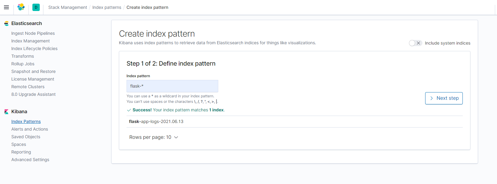
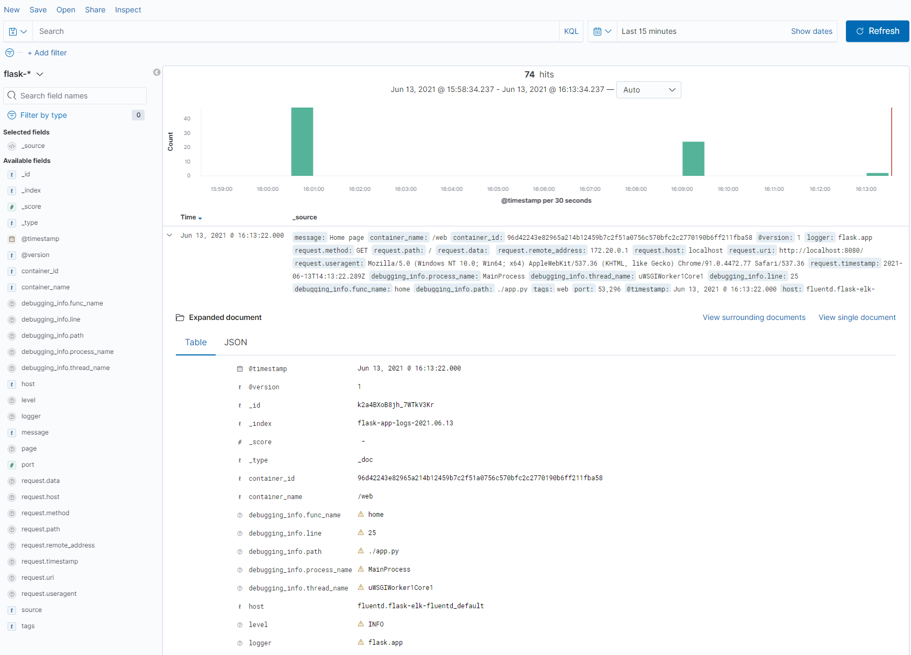

# Flask with monitoring and logging

Example application for using docker compose to simulate a kubernetes monitoring stack for a flask application. The stack contains a:
- Simple Flask application
- Prometheus metrics endpoint
- Fluentd logging aggregator for capturing the logs from the web app
- Elasticsearch server
- Kibana server for visualization
- Logstash for directing the logs from fluentd to Elasticsearch

## Run Stack

To run the full stack, run:
```
docker-compose up --build
```

and then go to:
- http://localhost:8080 for the flask web app
- http://localhost:8080/metrics for the prometheus metrics exported by the flask web app
- http://localhost:9200 for elasticsearch
- http://localhost:5601 for Kibana

To check the logs in Kibana create an index pattern in Stack Management -> Index Patterns as shown here with the time stamp field set to `@timestamp`:



Then in the Discover tab, you'll be able to see the logs from the web app:



Where the actual message logged will be in the `message` field, along with other fields added in by:
- the application logger (`logging_utils.ElkJsonFormatter`)
- fluentd
- logstash